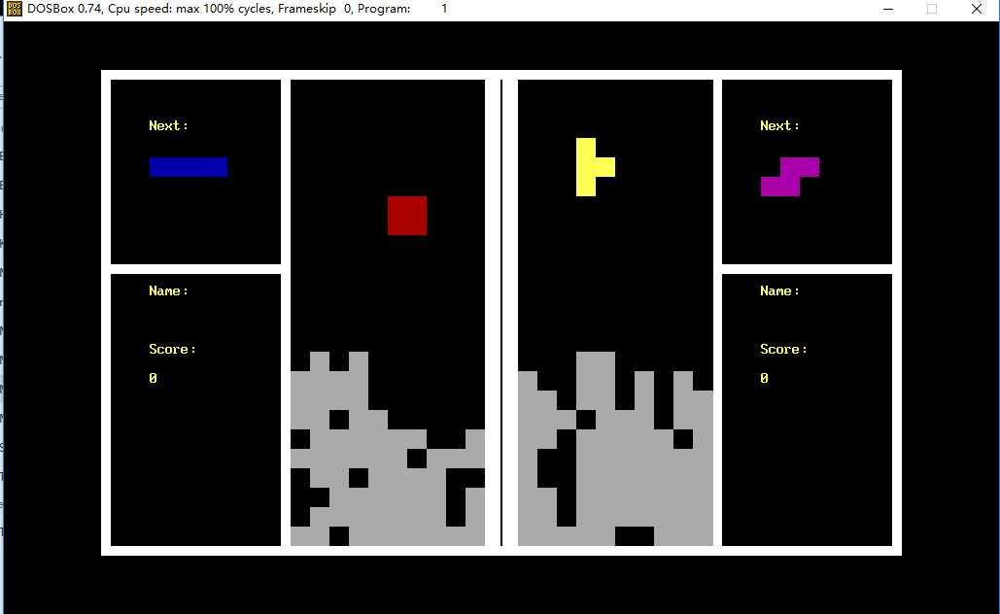

# 1. OVERVIEW
*DoubleTetris*, as its name reveals, is a **tetris game** that **two** persons can play **at the same time**.
As a homework assigned in the **C program design** course for freshman majoring in CS,
it is an **individual project** for **non-comercial** purposes.
This system allows you and one of your friends to enjoy the fun of tetris game,
recalling those precious childhood memory that you possess.

  

# 2. USAGE
The person on the left should use WASD keys, and the right should use UDLR keys,
for trasformation, moving to the left, dropping directly and moving to the right,
respectively.
  
# 3. LICENSE
The content of all the codes are supposed to use a licence [AGPLv3](./LICENSE)  

# 4. HOW TO CONTRIBUTE
1. Learn what is a AGPLv3, if you have not yet done so (see details above).  
2.  Create your change to the repo in question.
- Fork the desired repo, develop and test your code changes.
- Ensure that your code is clear and comprehensible.
- Ensure that your code has an appropriate set of unit tests which all pass.
3. Submit a pull request.
4. The repo owner will review your request. If it is approved, the change will be merged. If it needs additional work, the repo owner will respond with useful comments.

# 5. CREDIT
First of all, I would like to extend my sincere gratitude to my supervisor, Jingchun Xu, for his instructive advice and useful suggestions
on my learning on C program design course.  
High tribute shall be paid to Jiang Wu, whose profound knowledge of Tetris and C triggers my inspiration for this brilliant project.  
